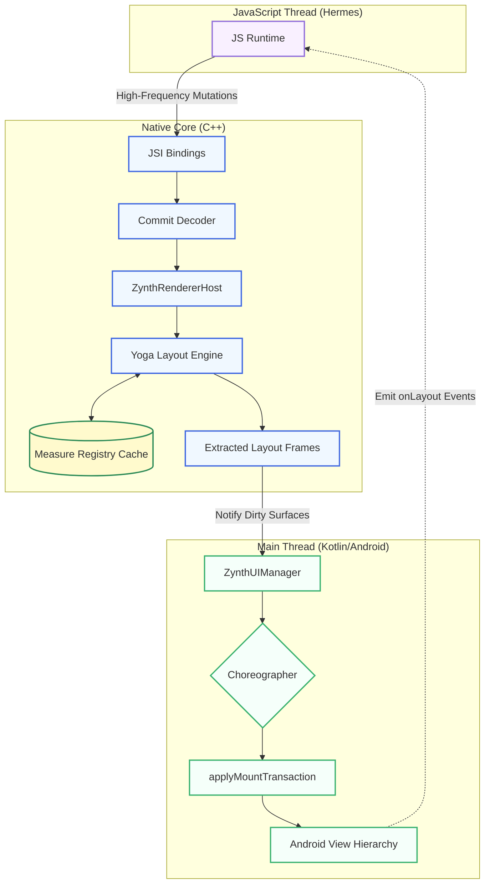

# Android Native Rendering Hot Path

This diagram illustrates the high-performance rendering pipeline from JavaScript through C++ (Yoga) to the Android Main Thread. A left-to-right flowchart is used to intuitively follow the data as it transforms through each layer.

## Key Stages

1.  **Decoding Phase:** The binary payload generated by JS is received via JSI and decoded in C++ (`ZynthCommitDecoder`), eliminating JSON parsing overhead.
2.  **Topology & Props:** The decoded commit is applied to C++ data structures (`ZynthRendererHost`). Nodes are inserted, removed, or styled.
3.  **Layout Engine:** The modifications are pushed to the **Yoga Engine**. Yoga calculates the flexbox layout. During this process, text nodes trigger native C++ callbacks that check the **Measure Registry Cache** to avoid redundant text measurements.
4.  **Frame Extraction:** Yoga extracts the newly calculated layout frames for any nodes that were mutated.
5.  **Main Thread Handoff:** The C++ core notifies the Kotlin `ZynthUIManager` that surfaces are dirty.
6.  **VSync Alignment:** The `ZynthUIManager` schedules a callback with the Android `Choreographer`. This ensures all high-frequency JS updates are batched and applied exactly once per screen refresh (VSync).
7.  **Mount Phase:** When the Choreographer fires, the Kotlin layer applies a mount transaction, translating the C++ layout frames into actual `view.layout(l, t, r, b)` calls on the native Android Views.
