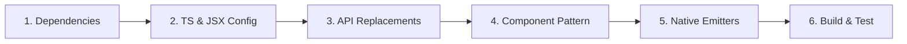

# Zynth Framework: SolidJS 1.x to 2.0 Official Migration Guide

## 📌 Overview & Purpose

This document serves as the **definitive, end-to-end technical guide** for migrating Zynth framework packages, native modules, and downstream applications from **SolidJS 1.x to SolidJS 2.0**.

It synthesizes the official SolidJS 2.0 specifications with Zynth's native architecture (`@solidjs/universal`, Hermes JSI HostObjects, and Yoga flex layout) to provide an efficient, repeatable blueprint for migrating remaining packages across the framework monorepo.

---

## 🏛️ Core Architectural Principles

When migrating code in the Zynth runtime, adhere to these five pillars:

1. **Reactivity Integrity (Zero Destructuring)**:
   Never destructure `props` in components or primitives. Props are reactive proxies; destructuring detaches reactive tracking.
2. **Universal Intrinsic Element Rule**:
   Never pass dynamic reactive accessors as inline attributes on intrinsic tags (`<view>`, `<text>`, `<image>`). Apply initial properties **synchronously** in `refProp` and update **imperatively** via 2-argument `createEffect`.
3. **Mandatory 2-Argument Effects**:
   Single-argument `createEffect(fn)` is deprecated in Solid 2.0 and throws `[MISSING_EFFECT_FN]` at runtime. Always use `createEffect(compute, apply)`.
4. **Staged Writes & `ownedWrite`**:
   Writes inside component render phases or owned computation scopes are forbidden in dev mode unless marked with `{ ownedWrite: true }`. Signal writes inside async callbacks (`setTimeout`, native event emitters) should execute outside owned scopes (`runWithOwner(null, fn)`).
5. **Use `@zynthjs/core` Bridge & Signal Primitives (Encapsulated JSI)**:
   Downstream packages must NEVER interact directly with raw global HostObjects (`globalThis.__ui`, `__zynth_host`, `__zynth_shared_signals`). Always import the unified, type-safe JSI wrappers and signal primitives from `@zynthjs/core` (`callNativeSync`, `callNative`, `createSharedSignal`, `createSyncSignal`, `sharedNativeEventEmitter`, `setProperty`).

---

## 🚀 The 6-Step Package Migration Protocol

Follow this checklist for each package being upgraded:



### Step 1: Upgrade Package Dependencies
Update `package.json` to reference Solid 2.0 packages and peer dependencies:

```json
{
  "peerDependencies": {
    "solid-js": "2.0.0-rc.1",
    "@zynthjs/core": ">=0.0.1-alpha.4"
  },
  "devDependencies": {
    "solid-js": "2.0.0-rc.1"
  }
}
```

> [!NOTE]
> If the package defines custom renderer extensions, depend on `@solidjs/universal: 2.0.0-rc.1` rather than legacy `solid-js/universal`.

---

### Step 2: Configure TypeScript & JSX Types

Ensure `tsconfig.json` (and `tsconfig.esm.json` / `tsconfig.types.json`) aligns with renderer-owned JSX:

```json
{
  "compilerOptions": {
    "jsx": "preserve",
    "jsxImportSource": "solid-js",
    "types": ["zynth-jsx"]
  }
}
```

- In type declarations and component interfaces, replace `JSX.Element` with `Element` (or `type { Element as SolidElement } from "solid-js"`).

---

### Step 3: Replace Deprecated & Removed APIs

Use this quick-reference transformation table:

| Solid 1.x (Legacy) | Solid 2.0 (Zynth Standard) | Notes |
| :--- | :--- | :--- |
| `import { createStore } from "solid-js/store"` | `import { createStore } from "solid-js"` | Store APIs moved into core `solid-js`. |
| `import { render } from "solid-js/universal"` | `import { createRenderer } from "@solidjs/universal"` | Standalone renderer package. |
| `splitProps(props, ["a", "b"])` | `omit(props, "a", "b")` | Direct `props.a` access for local, `omit` for rest. |
| `mergeProps(defaultProps, props)` | `merge(defaultProps, props)` | `undefined` is an explicit overriding value in `merge`. |
| `onMount(() => { ... })` | `onSettled(() => { ... return () => cleanup(); })` | Return cleanup function directly. |
| `createEffect(() => work(sig()))` | `createEffect(() => sig(), (val) => work(val))` | 2-arg compute/apply form mandatory. |
| `onCleanup(() => cleanup())` inside effects | `return () => cleanup()` from apply callback | Return cleanup from effect apply function. |
| `<Suspense fallback={...}>` | `<Loading fallback={...}>` | Async boundary component renamed. |
| `<ErrorBoundary fallback={...}>` | `<Errored fallback={...}>` | Error boundary component renamed. |
| `<Context.Provider value={...}>` | `<Context value={...}>` | Direct context component invocation. |
| `unwrap(store)` | `snapshot(store)` | Non-reactive plain object snapshot. |
| `produce((draft) => ...)` | Pass draft callback directly to store setter | Draft mutation is default in `createStore`. |
| `createResource(...)` | `createMemo(() => asyncFetch(...))` | Native async computations + `<Loading>`. |
| `batch(() => { ... })` | Rely on default microtask batching | Use `flush()` only at imperative sync boundaries. |

---

### Step 4: Apply Zynth Standard Component Pattern

Every native UI primitive or host-rendering component MUST follow this structure:

```tsx
import { createEffect, createSignal, onCleanup, createMemo, untrack } from "solid-js";
import type { ParentComponent, Element as SolidElement } from "solid-js";
import type { HostNode, StyleProp } from "@zynthjs/core";
import { setProperty } from "@zynthjs/core";
import { createStyle } from "../hooks/createStyle";

export interface CustomViewProps {
  style?: StyleProp | (() => StyleProp | undefined);
  disabled?: boolean;
  testID?: string;
  ref?: (node: HostNode | null) => void;
}

export const CustomView: ParentComponent<CustomViewProps> = (props) => {
  // 1. Maintain proxy tracking: DO NOT destructure props
  const local = props;

  // 2. Configure hostNode signal with ownedWrite: true
  const [hostNode, setHostNode] = createSignal<HostNode | null>(null, {
    ownedWrite: true,
  });

  const resolvedStyle = createStyle(() => {
    const s = local.style;
    return typeof s === "function" ? s() : s;
  });

  // 3. Helper to synchronize properties to native host node
  const applyProps = (node: HostNode) => {
    const st = resolvedStyle();
    if (st != null) setProperty(node, "style", st);
    if (local.disabled !== undefined) setProperty(node, "disabled", local.disabled);
    if (local.testID !== undefined) setProperty(node, "testID", local.testID);
  };

  // 4. Apply initial properties SYNCHRONOUSLY during node creation
  const refProp = (node: HostNode | null) => {
    if (node) {
      applyProps(node);
      setHostNode(node);
      local.ref?.(node);
      return;
    }
    setHostNode(null);
    local.ref?.(null);
  };

  // 5. Subsequent updates applied IMPERATIVELY via 2-arg createEffect
  createEffect(
    () => ({
      node: hostNode(),
      st: resolvedStyle(),
      dis: local.disabled,
      tid: local.testID,
    }),
    ({ node }) => {
      if (node) {
        // Use untrack for complex property application helpers
        untrack(() => applyProps(node));
      }
    }
  );

  onCleanup(() => {
    setHostNode(null);
    local.ref?.(null);
  });

  // 6. Keep intrinsic JSX tag clean (no dynamic attribute expressions)
  return (
    <view ref={refProp}>
      {props.children}
    </view>
  );
};
```

---

### Step 5: Native Emitter & Lifecycle Integration

When binding native event listeners to reactive signals:

```tsx
import { onSettled, createSignal, runWithOwner } from "solid-js";
import { sharedNativeEventEmitter } from "@zynthjs/core";

export function useNativeEventSubscription(eventName: string) {
  const [data, setData] = createSignal<unknown>(null);

  onSettled(() => {
    const subscription = sharedNativeEventEmitter.addListener(eventName, (payload) => {
      // Escape owned scope when setting signals from external asynchronous events
      runWithOwner(null, () => setData(payload));
    });

    // Return cleanup directly from onSettled callback
    return () => subscription.remove();
  });

  return data;
}
```

---

### Step 6: Verification & Validation

1. **Static Build Check**:
   ```bash
   tsc --project packages/<target-package>/tsconfig.esm.json
   tsc --project packages/<target-package>/tsconfig.types.json
   ```
2. **Search for Stale Symbols**:
   Ensure zero occurrences of:
   - `splitProps`
   - `JSX.Element`
   - `onMount`
   - `Suspense`
   - `1-argument createEffect`
3. **Verify Staged Writes**:
   In unit/component tests, call `flush()` when asserting immediate post-setter DOM or signal state:
   ```ts
   setCount(1);
   flush();
   expect(count()).toBe(1);
   ```

---

## 🧩 Architectural Blueprints by Package Type

### Blueprint A: Native Device API / Module (`zynth-apis`, `zynth-sensors`, `zynth-haptics`)

For packages exposing reactive device state from JSI/Bridge:

```ts
import { callNativeSync, getGlobalObject, sharedNativeEventEmitter } from "@zynthjs/core";
import { createSignal } from "solid-js";

const [revision, setRevision] = createSignal(0);
let currentSnapshot: SensorData = defaultData;

// Reactive binding accessor
export const sensorData = {
  get current(): SensorData {
    revision(); // Tracks dependency in Solid computations
    return currentSnapshot;
  },
  refresh(): SensorData {
    currentSnapshot = readNativeData();
    setRevision((v) => v + 1);
    return currentSnapshot;
  }
};
```

---

### Blueprint B: Web Fallback Component (`packages/*/web/`)

For components targeting the DOM web fallback:

```tsx
import { createMemo, omit, Show } from "solid-js";
import type { Element as SolidElement } from "solid-js";
import { registerComponent } from "@zynthjs/core";

export const WebCard = (props: {
  title?: string;
  children?: SolidElement;
  style?: Record<string, any>;
  [key: string]: any;
}) => {
  const local = props;
  const rest = omit(props, "title", "children", "style", "class");

  const cardStyle = createMemo(() => ({
    padding: "16px",
    "border-radius": "8px",
    ...local.style,
  }));

  return (
    <div style={cardStyle()} {...rest}>
      <Show when={local.title}>
        <h3>{local.title}</h3>
      </Show>
      {props.children}
    </div>
  );
};

registerComponent("card", WebCard);
```

---

## ⚠️ Troubleshooting & Error Diagnostic Matrix

| Error / Warning | Root Cause | Exact Remedy |
| :--- | :--- | :--- |
| `[MISSING_EFFECT_FN]` | Single-argument `createEffect(fn)` called. | Convert to 2-arg `createEffect(compute, apply)`. |
| `REACTIVE_WRITE_IN_OWNED_SCOPE` | Signal write occurred inside an owned tracking scope (e.g. `refProp` or render phase). | Add `{ ownedWrite: true }` to `createSignal(...)`, or wrap in `runWithOwner(null, fn)`. |
| `STRICT_READ_UNTRACKED` | Signal read inside an effect apply callback or component body outside tracking scope. | Move signal read into the effect's 1st arg (compute function), or wrap in `untrack()`. |
| `REACTIVITY_HALTED` | An uncaught owned write error escalated. | Fix the root `REACTIVE_WRITE_IN_OWNED_SCOPE` write. |
| `Cannot read property 'e' of undefined` | Inline dynamic signal accessor placed on intrinsic JSX tag (`<view style={s()}>`). | Apply properties imperatively via `refProp` + `createEffect` and keep intrinsic tags clean. |
| `onCleanup is forbidden in createTrackedEffect` | `onCleanup` called inside `onSettled` callback. | Return the cleanup function from `onSettled` callback (`return () => cleanup()`). |

---

## 📋 Framework Monorepo Package Migration Checklist

| Package Name | Category | Solid 2.0 Status | Priority | Key Migration Action Required |
| :--- | :--- | :--- | :--- | :--- |
| **`@zynthjs/core`** | Core Runtime | ✅ **MIGRATED** | Core | Maintained (`@solidjs/universal` renderer + JSI bridges). |
| **`@zynthjs/components`** | Native Primitives | ✅ **MIGRATED** | Core | Maintained (all 28 primitives + web fallbacks clean). |
| **`@zynthjs/apis`** | Core Device APIs | ✅ **MIGRATED** | Core | Maintained (`dimensions`, `font`, `safe-area`, `app-state`). |
| **`@zynthjs/ui`** | UI Design System | ⏳ **PENDING** | High | Replace `splitProps` with `omit`, verify `Button`/`Card`/`Badge`. |
| **`@zynthjs/screens`** | Navigation / Screens | ✅ **MIGRATED** | High | Maintained (`Screen.tsx` + containers on `merge`, `refProp` initial props, 2-arg `createEffect`). |
| **`@zynthjs/skia`** | 2D Graphics / Canvas | ⏳ **PENDING** | High | Replace `createResource` with async memos and `<Suspense>` with `<Loading>`. |
| **`@zynthjs/router`** | Routing Engine | ⏳ **PENDING** | High | Replace `onMount` with `onSettled`, update JSX element types. |
| **`@zynthjs/markdown`** | Markdown AST | ⏳ **PENDING** | Medium | Replace `splitProps` in markdown nodes, use 2-arg `createEffect`. |
| **`@zynthjs/icons`** | Vector Glyphs | ⏳ **PENDING** | Medium | Update icon component props and JSX runtime imports. |
| **`@zynthjs/safe-area`** | Layout Insets | ⏳ **PENDING** | Medium | Align with `zynth-apis/safe-area` context provider patterns. |
| **`@zynthjs/webview`** | Native WebView | ⏳ **PENDING** | Medium | Replace `splitProps` and convert `createEffect` in `WebView.tsx`. |
| **`@zynthjs/async-storage`** | Storage | ⏳ **PENDING** | Low | Verify JSI HostObject signals and reactive observers. |
| **`@zynthjs/sensors`** | Sensors | ⏳ **PENDING** | Low | Replace `onMount` with `onSettled` in `Sensors.ts`. |
| **`@zynthjs/haptics`** | Haptics | ⏳ **PENDING** | Low | Verify clean JSI signal wrappers. |
| **`@zynthjs/keyboard`** | Keyboard Manager | ⏳ **PENDING** | Low | Use `runWithOwner(null)` in keyboard event callbacks. |
| **`@zynthjs/media-library`** | Media Assets | ⏳ **PENDING** | Low | Convert async data loaders to async memos + `<Loading>`. |
| **`@zynthjs/image-picker`** | Camera & Photos | ⏳ **PENDING** | Low | Update README & examples from `onMount` to `onSettled`. |
| **`@zynthjs/splash-screen`** | Splash Screen | ⏳ **PENDING** | Low | Replace `onMount` in lifecycle wrappers. |
| **`@zynthjs/web-browser`** | In-App Browser | ⏳ **PENDING** | Low | Replace `onMount` with `onSettled`. |
| **`@zynthjs/secure-store`** | Keystore / Keychain | ⏳ **PENDING** | Low | Validate JSI synchronous crypto store methods. |
| **`@zynthjs/rsbuild-plugin`** | Build Plugin | ⏳ **PENDING** | Tooling | Update alias mappings from `solid-js/*` to `@solidjs/*`. |
| **`@zynthjs/cli`** | Developer CLI | ⏳ **PENDING** | Tooling | Verify app scaffold templates emit Solid 2.0 JSX and dependencies. |
