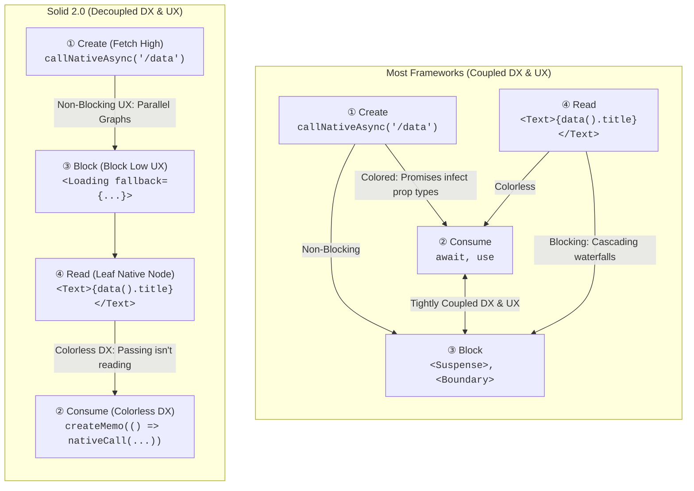
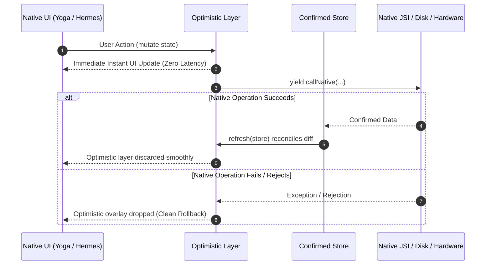
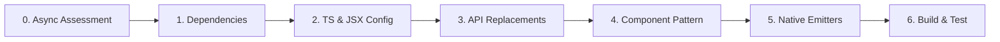

# Zynth Framework: SolidJS 1.x to 2.0 Official Migration Guide

## 📌 Overview & Purpose

This document serves as the **definitive, end-to-end technical guide** for migrating Zynth framework packages, native modules, and downstream applications from **SolidJS 1.x to SolidJS 2.0**.

It synthesizes the official SolidJS 2.0 specifications with Zynth's native architecture (`@solidjs/universal`, Hermes JSI HostObjects, and Yoga flex layout) to provide an efficient, repeatable blueprint for migrating packages across the framework monorepo.

Beyond mechanical syntax updates, this guide establishes the **SolidJS 2.0 Native Async Mental Model** ("Fetch High, Block Low", "Write Sync, Run Async", "One Graph"), requiring migrating engineers and agents to evaluate architectural modernization opportunities across every package in the framework.

---

## 🏛️ Core Architectural Principles

When migrating code in the Zynth runtime, adhere to these six pillars:

1. **Reactivity Integrity (Zero Destructuring)**:
   Never destructure `props` in components or primitives. Props are reactive proxies; destructuring detaches reactive tracking.
2. **Universal Component vs. Intrinsic Element Rule**:
   - **In UI Packages, Screens & Applications (`@zynthjs/ui`, `@zynthjs/screens`, apps)**: Always import and render the standard capitalized native components (`<View>`, `<Text>`, `<Image>`, `<Button>`) from `@zynthjs/components`.
   - **In Low-Level Primitive Definitions (`@zynthjs/components` internals)**: Never pass dynamic reactive accessors as inline attributes on intrinsic tags (`<view style={resolvedStyle()}>`). Apply initial properties **synchronously** in `refProp` and update **imperatively** via 2-argument `createEffect`. Keep intrinsic tags clean: `<view ref={refProp}>{props.children}</view>`.
3. **Mandatory 2-Argument Effects**:
   Single-argument `createEffect(fn)` is deprecated in Solid 2.0 and throws `[MISSING_EFFECT_FN]` at runtime. Always use `createEffect(compute, apply)`.
4. **Staged Writes & `ownedWrite`**:
   Writes inside component render phases or owned computation scopes are forbidden in dev mode unless marked with `{ ownedWrite: true }`. Signal writes inside async callbacks (`setTimeout`, native event emitters) should execute outside owned scopes (`runWithOwner(null, fn)`).
5. **Use `@zynthjs/core` Bridge & Signal Primitives (Encapsulated JSI)**:
   Downstream packages must NEVER interact directly with raw global HostObjects (`globalThis.__ui`, `__zynth_host`, `__zynth_shared_signals`). Always import the unified, type-safe JSI wrappers and signal primitives from `@zynthjs/core` (`callNativeSync`, `callNative`, `createSharedSignal`, `createSyncSignal`, `sharedNativeEventEmitter`, `setProperty`).
6. **Solid 2.0 Async Decoupling (Fetch High, Block Low, Write Sync)**:
   Async latency is a property of the value in the reactive graph, not a constraint on component architecture. Treat async reads as colorless values via `createMemo`, treat mutations as optimistic overlays via `createOptimisticStore` and generator `action`s, and decouple DX (data creation) from UX (loading affordances).

---

## ⚡ SolidJS 2.0 Native Async Mental Model: Framework Opportunities

SolidJS 2.0 introduces a fundamental paradigm shift in how asynchronous operations integrate with the reactive graph. In traditional frameworks, async values force an unyielding coupling between developer experience (DX: how functions consume promises) and user experience (UX: where loading boundaries block the UI). Solid 2.0 completely decouples these concerns.

### 📊 Paradigm Comparison: Most Frameworks vs. Solid 2.0



| Lifecycle Moment | Traditional Frameworks | SolidJS 2.0 (Zynth Runtime) |
| :--- | :--- | :--- |
| **1. Create** (Fetch / Native Call) | Initiated in component lifecycle or route loader. | Initiated as high as possible (`createMemo(() => callNative(...))`). |
| **2. Consume** (Await) | **Colored**: Signatures become `async`, props become `Promise<T>`. | **Colorless**: `memo()` returns `T`. The promise is resolved within the reactive graph. |
| **3. Block** (Boundary) | **Coupled to Consume**: Parent component suspends, creating waterfalls. | **Decoupled from Consume**: `<Loading fallback={...}>` wraps only the leaf visual affordance. |
| **4. Read** (Native View) | Blocked until all parent promises resolve. | **Passing isn't reading**: Intermediate components mount immediately; only leaf reads wait. |

---

### Part I: Async Reads — "Fetch High, Block Low"

#### 1. Colorless Async Computations
In Solid 2.0, an async computation is simply a `createMemo` that returns a Promise:

```tsx
import { createMemo, Loading } from "solid-js";
import { View, Text } from "@zynthjs/components";
import { callNative } from "@zynthjs/core";

export interface UserProfile {
  id: string;
  name: string;
  avatarUrl: string;
}

// Returns Accessor<UserProfile> — NOT Promise<UserProfile>
export function useUserProfile(userId: string) {
  return createMemo(() =>
    callNative<UserProfile>("UserService", "getProfile", { userId })
  );
}
```

- **Zero Type Pollution**: The memo accessor returns `T`, not `Promise<T>` or `T | undefined`.
- **Derivations Just Work**: A memo deriving from an async memo (`createMemo(() => user().name.toUpperCase())`) becomes async automatically without `.then()` or `await`.
- **Passing Props Isn't Reading**: Passing `profile={profile()}` through layout containers (`<Screen>`, `<Card>`, `<View>`) evaluates lazily at the leaf JSX node (`<Text>`). Intermediate containers never stall or re-render.

#### 2. Eliminating Cascading Waterfalls
Components in Zynth mount once immediately up-front. Child components that depend on separate async values execute in parallel regardless of nesting depth:

```tsx
import { createMemo, Loading } from "solid-js";
import { View, Text, ScrollView } from "@zynthjs/components";
import { callNative } from "@zynthjs/core";

// Both native queries run in PARALLEL, not in a waterfall!
export function DashboardScreen(props: { userId: string }) {
  const profile = createMemo(() => callNative("User", "getProfile", { id: props.userId }));
  const stats = createMemo(() => callNative("Analytics", "getStats", { id: props.userId }));

  return (
    <ScrollView>
      <Loading fallback={<ProfileSkeleton />}>
        <ProfileCard profile={profile()} />
      </Loading>
      <Loading fallback={<StatsSkeleton />}>
        <StatsCard stats={stats()} />
      </Loading>
    </ScrollView>
  );
}

function ProfileCard(props: { profile: UserProfile }) {
  return (
    <View style={{ padding: 16 }}>
      <Text style={{ fontSize: 18, fontWeight: "bold" }}>{props.profile.name}</Text>
    </View>
  );
}
```

#### 3. Graph Querying: `isPending` & `latest`
Instead of maintaining manual boolean signals (`isLoading`, `isFetching`), query the reactive graph directly:
- **`isPending(accessor)`**: Returns `true` when a background revalidation or dependency update is in flight. Use it to dim stale native views, display subtle spinners, or disable touch targets.
- **`latest(accessor)`**: Returns the value the graph is currently working toward before the async transition completes (ideal for instant navigation tab indicators).

```tsx
import { isPending, latest, createSignal } from "solid-js";
import { View, Text, Pressable } from "@zynthjs/components";

export function TabBar(props: { selectedTab: string; onSelect: (tab: string) => void }) {
  return (
    <View style={{ flexDirection: "row", opacity: isPending(props.selectedTab) ? 0.7 : 1 }}>
      <Text>Active: {latest(props.selectedTab)}</Text>
    </View>
  );
}
```

---

### Part II: Async Writes & Optimistic UI — "Write Sync, Run Async"

In native mobile apps, offline-first reliability and zero-latency user interaction are critical. In Solid 2.0, **your synchronous UI logic was the optimistic UI all along**.



#### 1. `createOptimisticStore` & Generator `action`s
Generator functions (`function*`) allow Solid to maintain reactive context across asynchronous points via `yield`:

```ts
import { createOptimisticStore, action, refresh } from "solid-js";
import { callNative } from "@zynthjs/core";

export interface Item {
  id: string;
  title: string;
  enabled: boolean;
}

export function createItemsManager() {
  const [items, setItems] = createOptimisticStore<Item[]>(
    () => callNative<Item[]>("Database", "getItems"),
    []
  );

  const toggleItem = action(function* (id: string, enabled: boolean) {
    // 1. Synchronous optimistic update applies immediately to native UI
    setItems((list) => {
      const target = list.find((item) => item.id === id);
      if (target) target.enabled = enabled;
    });

    // 2. Yield native JSI write promise
    yield callNative("Database", "updateItem", { id, enabled });

    // 3. Revalidate confirmed store
    refresh(items);
  });

  return [items, { toggleItem }] as const;
}
```

- **Zero Manual Rollback**: If `callNative` throws, the optimistic overlay is automatically discarded.
- **Atomic Transactions**: Rapid native taps do not cause race conditions or state corruption.

---

### Part III: Streaming, Event Iterators & Resilient Boundaries

#### 1. Native Hardware Streams with `live`
For continuous native hardware feeds (Sensors, Geolocation, Bluetooth LE, Device telemetry), use `live` generator streams:

```ts
import { live } from "@solidjs/universal";
import { sharedNativeEventEmitter } from "@zynthjs/core";

export interface TelemetryData {
  value: number;
  timestamp: number;
}

export const deviceTelemetry = live(async function* () {
  const buffer: TelemetryData[] = [];
  const sub = sharedNativeEventEmitter.addListener("onTelemetry", (data) => buffer.push(data));

  try {
    while (true) {
      if (buffer.length > 0) {
        yield buffer.shift()!;
      }
      await new Promise((resolve) => setTimeout(resolve, 16));
    }
  } finally {
    sub.remove();
  }
});
```

#### 2. Auto-Healing Error Boundaries (`<Errored>`)
In Solid 2.0, errors are not dead-ends. When upstream native data sources reconnect or re-resolve, `<Errored>` boundaries heal automatically without full component re-mounting:

```tsx
import { Errored } from "solid-js";
import { View, Text, Button } from "@zynthjs/components";

export function SafeTelemetryView() {
  return (
    <Errored fallback={(err, reset) => (
      <View style={{ padding: 16, backgroundColor: "#fee" }}>
        <Text style={{ color: "#c00" }}>Hardware link lost: {err.message}</Text>
        <Button title="Reconnect" onPress={() => reset()} />
      </View>
    )}>
      <TelemetryDisplay />
    </Errored>
  );
}
```

---

## 🚀 The 7-Step Package Migration Protocol

Follow this structured protocol for every package being upgraded:



### Step 0: Async & Reactive Opportunity Assessment (MANDATORY)

Before making mechanical code changes, evaluate the package for Solid 2.0 architectural opportunities:

| Question / Code Smell | Legacy Anti-Pattern | Modern Solid 2.0 Opportunity |
| :--- | :--- | :--- |
| Does the package maintain manual loading flags? | `const [loaded, setLoaded] = createSignal(false)` | Replace with `createMemo(() => asyncNativeCall())` consumed under `<Loading>`. |
| Does the package load remote/local assets, fonts, or media? | Custom Promise/callback loaders returning boolean accessors | Expose colorless async accessors via `createMemo(() => loadAsset(...))` under `<Loading>`. |
| Does the package query asynchronous native APIs or services? | `createResource` or manual Promise state handling | Return clean colorless `Accessor<T>` via `createMemo(() => callNative(...))`. |
| Does the package perform native disk / storage / keychain writes? | Manual promise resolution + rollback state | Use `createOptimisticStore` + generator `action(function*)` for zero-latency UI with automatic rollback. |
| Does the package subscribe to continuous hardware event streams? | Manual `onSettled` + `addListener` boilerplate | Use encapsulated JSI signal or `live` async iterator with automated lifecycle cleanup. |
| Does the package wrap components in `<Suspense>`? | `<Suspense fallback={<Spinner />}>` | Upgrade to `<Loading fallback={<Skeleton />}>` placed low in the component tree. |
| Does the package use manual error state variables? | `const [error, setError] = createSignal(null)` | Use auto-healing `<Errored fallback={...}>` boundaries that automatically recover on signal resolution. |

---

### Step 1: Upgrade Package Dependencies
Update `package.json` to reference Solid 2.0 packages and peer dependencies:

```json
{
  "peerDependencies": {
    "solid-js": "2.0.0-rc.1",
    "@zynthjs/core": ">=0.0.1-alpha.4"
  },
  "devDependencies": {
    "solid-js": "2.0.0-rc.1"
  }
}
```

> [!NOTE]
> If the package defines custom renderer extensions, depend on `@solidjs/universal: 2.0.0-rc.1` rather than legacy `solid-js/universal`.

---

### Step 2: Configure TypeScript & JSX Types

Ensure `tsconfig.json` (and `tsconfig.esm.json` / `tsconfig.types.json`) aligns with renderer-owned JSX:

```json
{
  "compilerOptions": {
    "jsx": "preserve",
    "jsxImportSource": "solid-js",
    "types": ["zynth-jsx"]
  }
}
```

- In type declarations and component interfaces, replace `JSX.Element` with `Element` (or `type { Element as SolidElement } from "solid-js"`).

---

### Step 3: Replace Deprecated & Removed APIs

Use this quick-reference transformation table:

| Solid 1.x (Legacy) | Solid 2.0 (Zynth Standard) | Notes |
| :--- | :--- | :--- |
| `import { createStore } from "solid-js/store"` | `import { createStore } from "solid-js"` | Store APIs moved into core `solid-js`. |
| `import { render } from "solid-js/universal"` | `import { createRenderer } from "@solidjs/universal"` | Standalone renderer package. |
| `splitProps(props, ["a", "b"])` | `omit(props, "a", "b")` | Direct `props.a` access for local, `omit` for rest. |
| `mergeProps(defaultProps, props)` | `merge(defaultProps, props)` | `undefined` is an explicit overriding value in `merge`. |
| `onMount(() => { ... })` | `onSettled(() => { ... return () => cleanup(); })` | Return cleanup function directly. |
| `createEffect(() => work(sig()))` | `createEffect(() => sig(), (val) => work(val))` | 2-arg compute/apply form mandatory. |
| `onCleanup(() => cleanup())` inside effects | `return () => cleanup()` from apply callback | Return cleanup from effect apply function. |
| `<Suspense fallback={...}>` | `<Loading fallback={...}>` | Async boundary component renamed. |
| `<ErrorBoundary fallback={...}>` | `<Errored fallback={...}>` | Error boundary component renamed. |
| `<Context.Provider value={...}>` | `<Context value={...}>` | Direct context component invocation. |
| `unwrap(store)` | `snapshot(store)` | Non-reactive plain object snapshot. |
| `produce((draft) => ...)` | Pass draft callback directly to store setter | Draft mutation is default in `createStore`. |
| `createResource(...)` | `createMemo(() => asyncFetch(...))` | Native async computations + `<Loading>`. |
| `batch(() => { ... })` | Rely on default microtask batching | Use `flush()` only at imperative sync boundaries. |

---

### Step 4: Apply Zynth Standard Component Pattern

> [!IMPORTANT]
> **Component Consumer Usage vs. Primitive Authoring**:
> - **In UI packages, screens, and application components (`@zynthjs/ui`, `@zynthjs/screens`, apps)**: Always import and render the standard capitalized native components (`<View>`, `<Text>`, `<Image>`, `<Button>`) from `@zynthjs/components`.
> - **In primitive implementation internals (`@zynthjs/components` primitives)**: Host wrappers bind directly to Yoga & Hermes JSI using the universal intrinsic `<view ref={refProp}>` or `<text ref={refProp}>` following this mandatory pattern:

```tsx
import { createEffect, createSignal, onCleanup, untrack } from "solid-js";
import type { ParentComponent } from "solid-js";
import type { HostNode, StyleProp } from "@zynthjs/core";
import { setProperty } from "@zynthjs/core";
import { createStyle } from "../hooks/createStyle";

export interface CustomViewProps {
  style?: StyleProp | (() => StyleProp | undefined);
  disabled?: boolean;
  testID?: string;
  ref?: (node: HostNode | null) => void;
}

export const CustomView: ParentComponent<CustomViewProps> = (props) => {
  // 1. Maintain proxy tracking: DO NOT destructure props
  const local = props;

  // 2. Configure hostNode signal with ownedWrite: true
  const [hostNode, setHostNode] = createSignal<HostNode | null>(null, {
    ownedWrite: true,
  });

  const resolvedStyle = createStyle(() => {
    const s = local.style;
    return typeof s === "function" ? s() : s;
  });

  // 3. Helper to synchronize properties to native host node
  const applyProps = (node: HostNode) => {
    const st = resolvedStyle();
    if (st != null) setProperty(node, "style", st);
    if (local.disabled !== undefined) setProperty(node, "disabled", local.disabled);
    if (local.testID !== undefined) setProperty(node, "testID", local.testID);
  };

  // 4. Apply initial properties SYNCHRONOUSLY during node creation
  const refProp = (node: HostNode | null) => {
    if (node) {
      applyProps(node);
      setHostNode(node);
      local.ref?.(node);
      return;
    }
    setHostNode(null);
    local.ref?.(null);
  };

  // 5. Subsequent updates applied IMPERATIVELY via 2-arg createEffect
  createEffect(
    () => ({
      node: hostNode(),
      st: resolvedStyle(),
      dis: local.disabled,
      tid: local.testID,
    }),
    ({ node }) => {
      if (node) {
        // Use untrack for complex property application helpers
        untrack(() => applyProps(node));
      }
    }
  );

  onCleanup(() => {
    setHostNode(null);
    local.ref?.(null);
  });

  // 6. Keep intrinsic JSX tag clean (no dynamic attribute expressions)
  return (
    <view ref={refProp}>
      {props.children}
    </view>
  );
};
```

---

### Step 5: Native Emitter & Lifecycle Integration

When binding native event listeners to reactive signals:

```tsx
import { onSettled, createSignal, runWithOwner } from "solid-js";
import { sharedNativeEventEmitter } from "@zynthjs/core";

export function useNativeEventSubscription(eventName: string) {
  const [data, setData] = createSignal<unknown>(null);

  onSettled(() => {
    const subscription = sharedNativeEventEmitter.addListener(eventName, (payload) => {
      // Escape owned scope when setting signals from external asynchronous events
      runWithOwner(null, () => setData(payload));
    });

    // Return cleanup directly from onSettled callback
    return () => subscription.remove();
  });

  return data;
}
```

---

### Step 6: Verification & Validation

1. **Static Build Check**:
   ```bash
   tsc --project packages/<target-package>/tsconfig.esm.json
   tsc --project packages/<target-package>/tsconfig.types.json
   ```
2. **Search for Stale Symbols**:
   Ensure zero occurrences of:
   - `splitProps`
   - `JSX.Element`
   - `onMount`
   - `Suspense`
   - `1-argument createEffect`
3. **Verify Staged Writes**:
   In unit/component tests, call `flush()` when asserting immediate post-setter DOM or signal state:
   ```ts
   setCount(1);
   flush();
   expect(count()).toBe(1);
   ```

---

## 🧩 Architectural Blueprints by Package Type

### Blueprint A: Native Device API / Module (`zynth-apis`, `zynth-haptics`)

For packages exposing reactive device state from JSI/Bridge:

```ts
import { callNativeSync, sharedNativeEventEmitter } from "@zynthjs/core";
import { createSignal } from "solid-js";

const [revision, setRevision] = createSignal(0);
let currentSnapshot: DeviceInfo = defaultData;

// Reactive binding accessor
export const deviceInfo = {
  get current(): DeviceInfo {
    revision(); // Tracks dependency in Solid computations
    return currentSnapshot;
  },
  refresh(): DeviceInfo {
    currentSnapshot = readNativeData();
    setRevision((v) => v + 1);
    return currentSnapshot;
  }
};
```

---

### Blueprint B: UI Primitive / Native Component (`zynth-components`, `zynth-ui`)

For components wrapping native Yoga layout elements with reactive styles:

```tsx
import { createMemo, omit } from "solid-js";
import type { Element as SolidElement } from "solid-js";
import { View, Text } from "@zynthjs/components";

export const Card = (props: {
  title?: string;
  children?: SolidElement;
  style?: Record<string, any>;
}) => {
  const local = props;
  const cardStyle = createMemo(() => ({
    padding: 16,
    borderRadius: 8,
    backgroundColor: "#ffffff",
    ...local.style,
  }));

  return (
    <View style={cardStyle()}>
      {local.title ? <Text style={{ fontWeight: "bold" }}>{local.title}</Text> : null}
      {props.children}
    </View>
  );
};
```

---

### Blueprint C: Generalized Native Async Resource & Query Loader (`zynth-apis`, `zynth-skia`, `zynth-media-library`)

Modernizing asynchronous native data fetchers, asset decoders, or hardware queries into colorless reactive memos:

```ts
import { createMemo, type Accessor } from "solid-js";
import { callNative } from "@zynthjs/core";

export interface ResourceDescriptor<T> {
  module: string;
  method: string;
  params?: Record<string, unknown>;
}

/**
 * Solid 2.0 Colorless Native Resource Query Hook.
 * Executes asynchronously via JSI and integrates seamlessly with <Loading> boundaries.
 */
export function createNativeResource<T>(
  descriptor: () => ResourceDescriptor<T>
): Accessor<T> {
  return createMemo(async () => {
    const desc = descriptor();
    const result = await callNative<T>(desc.module, desc.method, desc.params);
    return result;
  });
}
```

**Usage in Zynth Components**:
```tsx
import { Loading } from "solid-js";
import { View, Text, Image } from "@zynthjs/components";
import { createNativeResource } from "@zynthjs/core";

export function MediaCard(props: { assetId: string }) {
  const asset = createNativeResource(() => ({
    module: "MediaLibrary",
    method: "getAssetMetadata",
    params: { assetId: props.assetId },
  }));

  return (
    <Loading fallback={<View style={{ height: 200, backgroundColor: "#eee" }} />}>
      <View style={{ padding: 12 }}>
        <Text style={{ fontSize: 16 }}>{asset().title}</Text>
        <Image source={{ uri: asset().uri }} style={{ width: "100%", height: 180 }} />
      </View>
    </Loading>
  );
}
```

---

### Blueprint D: Optimistic Native Storage Store (`zynth-async-storage`, `zynth-secure-store`)

Providing zero-latency optimistic state updates backed by native persistent storage:

```ts
import { createOptimisticStore, action, refresh } from "solid-js";
import { callNative } from "@zynthjs/core";

export function createPersistentStore<T extends object>(
  key: string,
  initialValue: T
) {
  const [store, setStore] = createOptimisticStore<T>(
    async () => {
      const raw = await callNative<string>("Storage", "getItem", { key });
      return raw ? (JSON.parse(raw) as T) : initialValue;
    },
    initialValue
  );

  const mutate = action(function* (updater: (draft: T) => void) {
    // 1. Instant local mutation (zero latency on UI)
    setStore(updater);
    const updatedState = store;

    // 2. Asynchronously persist to native disk/keychain
    yield callNative("Storage", "setItem", {
      key,
      value: JSON.stringify(updatedState),
    });

    // 3. Reconcile confirmed state
    refresh(store);
  });

  return [store, mutate] as const;
}
```

---

### Blueprint E: Continuous Reactive Native Hardware Stream (`zynth-sensors`, `zynth-bluetooth`, `zynth-location`)

Wrapping continuous hardware event emitters into reactive streams with automated lifecycle management:

```ts
import { onSettled, createSignal, runWithOwner } from "solid-js";
import { sharedNativeEventEmitter } from "@zynthjs/core";

export interface SensorPayload {
  x: number;
  y: number;
  z: number;
  timestamp: number;
}

export function createSensorStream(sensorName: string) {
  const [data, setData] = createSignal<SensorPayload>({
    x: 0,
    y: 0,
    z: 0,
    timestamp: Date.now(),
  });

  onSettled(() => {
    const subscription = sharedNativeEventEmitter.addListener(
      `on${sensorName}Update`,
      (payload: SensorPayload) => {
        // Break out of owned reactive scope for external native events
        runWithOwner(null, () => setData(payload));
      }
    );

    return () => subscription.remove();
  });

  return data;
}
```

---

## ⚠️ Troubleshooting & Error Diagnostic Matrix

| Error / Warning | Root Cause | Exact Remedy |
| :--- | :--- | :--- |
| `[MISSING_EFFECT_FN]` | Single-argument `createEffect(fn)` called. | Convert to 2-arg `createEffect(compute, apply)`. |
| `REACTIVE_WRITE_IN_OWNED_SCOPE` | Signal write occurred inside an owned tracking scope (e.g. `refProp` or render phase). | Add `{ ownedWrite: true }` to `createSignal(...)`, or wrap in `runWithOwner(null, fn)`. |
| `STRICT_READ_UNTRACKED` | Signal read inside an effect apply callback or component body outside tracking scope. | Move signal read into the effect's 1st arg (compute function), or wrap in `untrack()`. |
| `REACTIVITY_HALTED` | An uncaught owned write error escalated. | Fix the root `REACTIVE_WRITE_IN_OWNED_SCOPE` write. |
| `Cannot read property 'e' of undefined` | Inline dynamic signal accessor placed on intrinsic JSX tag (`<view style={s()}>`). | Apply properties imperatively via `refProp` + `createEffect` and keep intrinsic tags clean. |
| `onCleanup is forbidden in createTrackedEffect` | `onCleanup` called inside `onSettled` callback. | Return the cleanup function from `onSettled` callback (`return () => cleanup()`). |

---

## 📋 Framework Monorepo Package Migration Checklist

| Package Name | Category | Solid 2.0 Status | Priority | Key Migration Action & Async Opportunities |
| :--- | :--- | :--- | :--- | :--- |
| **`@zynthjs/core`** | Core Runtime | ✅ **MIGRATED** | Core | Maintained (`@solidjs/universal` renderer + JSI bridges). Opportunities: Core `createNativeResource` helper. |
| **`@zynthjs/components`** | Native Primitives | ✅ **MIGRATED** | Core | Maintained (all 28 primitives + clean JSX). Opportunities: Seamless `<Loading>` leaf boundaries. |
| **`@zynthjs/apis`** | Core Device APIs | ✅ **MIGRATED** | Core | Maintained (`dimensions`, `font`, `safe-area`, `app-state`). Opportunities: Colorless asset/font loaders. |
| **`@zynthjs/ui`** | UI Design System | ⏳ **PENDING** | High | Replace `splitProps` with `omit`, verify `Button`/`Card`/`Badge`. Integrate `<Loading>` fallbacks. |
| **`@zynthjs/screens`** | Navigation / Screens | ✅ **MIGRATED** | High | Maintained (`Screen.tsx` on `merge`, `refProp` initial props, 2-arg `createEffect`). Opportunities: `latest()` screen state transitions. |
| **`@zynthjs/skia`** | 2D Graphics / Canvas | ⏳ **PENDING** | High | Replace `createResource` with async memos, use `<Loading>` for typeface/SVG loads. |
| **`@zynthjs/router`** | Routing Engine | ⏳ **PENDING** | High | Replace `onMount` with `onSettled`, adopt API-less async transitions and `isPending()`. |
| **`@zynthjs/markdown`** | Markdown AST | ⏳ **PENDING** | Medium | Replace `splitProps` in markdown nodes, use 2-arg `createEffect`. |
| **`@zynthjs/icons`** | Vector Glyphs | ⏳ **PENDING** | Medium | Update icon component props and JSX runtime imports. |
| **`@zynthjs/safe-area`** | Layout Insets | ⏳ **PENDING** | Medium | Align with `zynth-apis/safe-area` context provider patterns. |
| **`@zynthjs/webview`** | Native WebView | ⏳ **PENDING** | Medium | Replace `splitProps` and convert `createEffect` in `WebView.tsx`. |
| **`@zynthjs/async-storage`** | Storage | ⏳ **PENDING** | Low | Implement Blueprint D: `createOptimisticStore` + generator `action`s. |
| **`@zynthjs/sensors`** | Sensors | ⏳ **PENDING** | Low | Implement Blueprint E: continuous reactive sensor streams + `onSettled`. |
| **`@zynthjs/haptics`** | Haptics | ⏳ **PENDING** | Low | Verify clean JSI synchronous trigger methods. |
| **`@zynthjs/keyboard`** | Keyboard Manager | ⏳ **PENDING** | Low | Use `runWithOwner(null)` in keyboard event callbacks. |
| **`@zynthjs/media-library`** | Media Assets | ⏳ **PENDING** | Low | Convert async asset queries to async memos + `<Loading>`. |
| **`@zynthjs/image-picker`** | Camera & Photos | ⏳ **PENDING** | Low | Update README & examples from `onMount` to `onSettled`. |
| **`@zynthjs/splash-screen`** | Splash Screen | ⏳ **PENDING** | Low | Replace `onMount` in lifecycle wrappers. |
| **`@zynthjs/web-browser`** | In-App Browser | ⏳ **PENDING** | Low | Replace `onMount` with `onSettled`. |
| **`@zynthjs/secure-store`** | Keystore / Keychain | ⏳ **PENDING** | Low | Implement optimistic encryption cache backed by JSI crypto. |
| **`@zynthjs/rsbuild-plugin`** | Build Plugin | ⏳ **PENDING** | Tooling | Update alias mappings from `solid-js/*` to `@solidjs/*`. |
| **`@zynthjs/cli`** | Developer CLI | ⏳ **PENDING** | Tooling | Verify app scaffold templates emit Solid 2.0 JSX and dependencies. |


